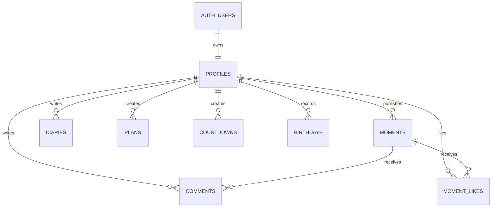

# 哒咔Ba (DakaBa)

移动端优先的个人打卡、日历、日记和“个人朋友圈”应用。前端使用 Vue 3 + Vite + Pinia + Tailwind CSS，后端使用 Supabase，适合部署到 Vercel 免费层。

## 数据库 ER 图



核心表：

- `profiles`：头像、昵称、签名、角色。
- `account_recovery`：找回密码问题和答案哈希，只允许本人访问。
- `moments`：朋友圈动态，`visibility` 必须是 `private` 或 `public`。
- `diaries`：私密日记和心情记录，只能本人读取。
- `plans`：每日计划和完成状态。
- `countdowns`：倒计时。
- `birthdays`：生日记录。
- `comments` / `moment_likes`：只允许对可见动态互动。
- `activity_logs`：操作日志，用户只能看自己的日志。

完整 SQL 在 [supabase/schema.sql](C:/Users/玫瑰蓝/Documents/哒咔Ba/supabase/schema.sql)。

## 前端路由结构

- `/`：Dashboard，今日计划、倒计时、像素宠物。
- `/calendar`：按月日历，有记录的日子标记圆点，生日当天特殊标识。
- `/feed`：个人朋友圈动态流，支持月份和标签筛选、点赞、导出图片水印。
- `/publish`：发布动态，必须选择私密或公开，图片发布前压缩为 WebP。
- `/profile`：头像、昵称、个人签名。
- `/settings`：账号与安全入口、主题、缓存清理、数据导出、关于。
- `/admin`：仅统计面板，不读取任何私密内容。
- `/auth`：手机号登录/注册。

## 隐私原则

Supabase 已按“说私密就是真私密”设计：

- 私密日记 `diaries` 的 RLS 是 `user_id = auth.uid()`。
- 私密动态 `moments` 查询策略是 `visibility = 'public' or user_id = auth.uid()`。
- 评论和点赞也必须先通过动态可见性检查。
- 管理台只调用 `get_admin_stats()`，仅返回人数、活跃、总打卡、存储占用等统计，不提供绕过 RLS 查看私密日记或私密动态的接口。
- 不建议在前端或普通 Serverless API 中使用 Supabase service role key。
- 当前前端示例只演示字段流转；正式上线时，找回密码答案应通过 Supabase Edge Function 做加盐哈希校验，不要把明文答案保存在数据库。

## 启动

1. 复制 `.env.example` 为 `.env.local`，填入 Supabase URL 和 anon key。
2. 在 Supabase SQL Editor 执行 `supabase/schema.sql`。
3. 安装依赖并启动：

```bash
npm install
npm run dev
```

## 部署

Vercel 会读取 `vercel.json`，把所有路径重写到 Vue SPA 首页。部署时添加：

- `VITE_SUPABASE_URL`
- `VITE_SUPABASE_ANON_KEY`
- `VITE_SITE_URL`

## 核心代码位置

- 朋友圈发布：[src/views/Publish.vue](C:/Users/玫瑰蓝/Documents/哒咔Ba/src/views/Publish.vue)
- 动态流：[src/views/Feed.vue](C:/Users/玫瑰蓝/Documents/哒咔Ba/src/views/Feed.vue)
- Supabase 动态接口：[src/api/feed.js](C:/Users/玫瑰蓝/Documents/哒咔Ba/src/api/feed.js)
- 日记接口：[src/api/diary.js](C:/Users/玫瑰蓝/Documents/哒咔Ba/src/api/diary.js)
- 统计接口：[src/api/admin.js](C:/Users/玫瑰蓝/Documents/哒咔Ba/src/api/admin.js)
